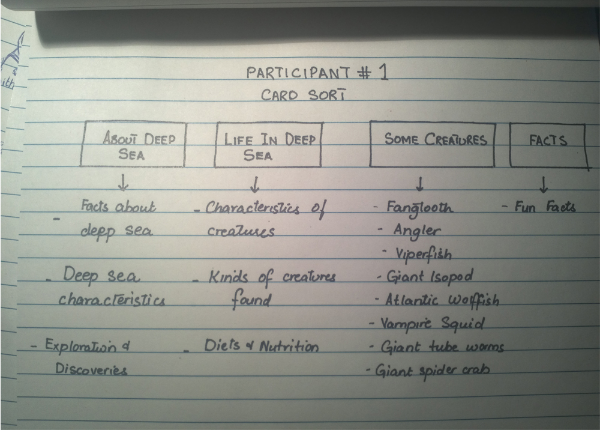
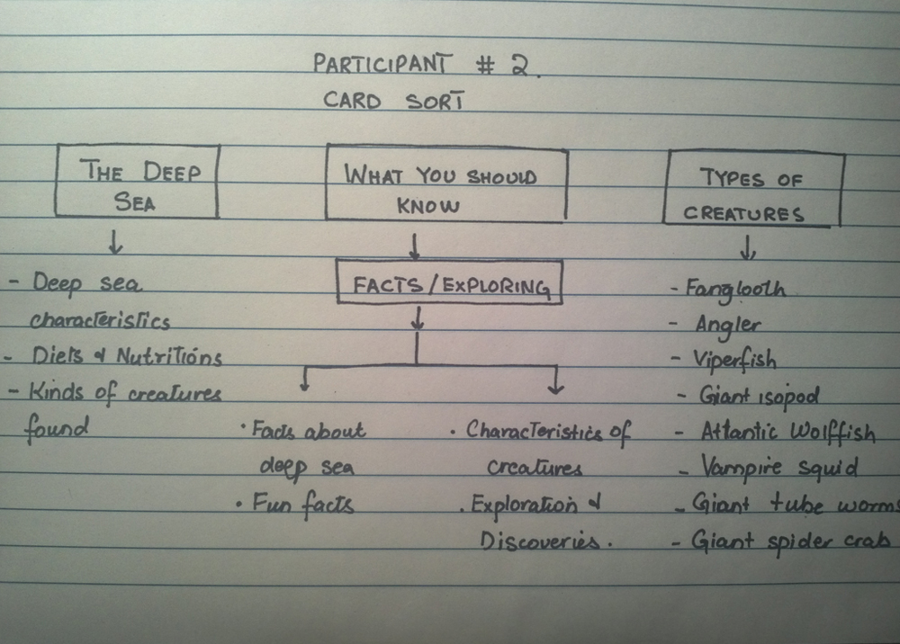

# Card sort report

The purpose of this card sort was to determine common navigation patterns and categories from the content of Deep Sea Creatures website.

## Specifics

The card sort was conducted by Sundus on Sept 10 between the times of 4:00pm and 5:00pm with the following participants:

- Dima Badawi	
- Anna

### Cards

15 cards were used covering a broad range of applicable content for the website. The following topics were used as cards:

1. Deep Sea Characteristics
2. Facts about the Deep Sea
3. Deep Sea Exploration and Discoveries
4. Kinds of Creatures
5. General Characteristics of living organisms
6. Diets
7. Fangtooth Fish
8. Angler Fish
9. Viper Fish
10. Giant Ispopod
11. Atlantic Wolffish
12. Vampire Squid
13. Giant Tube Worms
14. Giant Spider Crab
15. Fun Facts

## Card sort results

*Card sort 1 by Dima Badawi*

*Card sort 2 by Anna*

## Observations

- Did the participants have any common comments?
	- The participants were confused wether the website is about the sea or the creatures themselves

- Did they have questions that stood out?
	- The category *Diets and Nutritions* confused them when it came to categorizing it.
- Did they struggle with certain articles or topics?
	- The participants did not have knowledge about the subject and struggled with most of the categories

- Did they find common groupings? Or were the groupings completely different?
	- There was some common grouping

- Were some of the groupings completely unexpected?
	- No, the groups were expected and made sense

- Were the results similar to your expectations?
	- Yes
- How did you feel while watching them perform the task?
	- I felt that the website needs categories to help them categorize the groups easily. I realized that some informaiton that is important should be added to the website. 